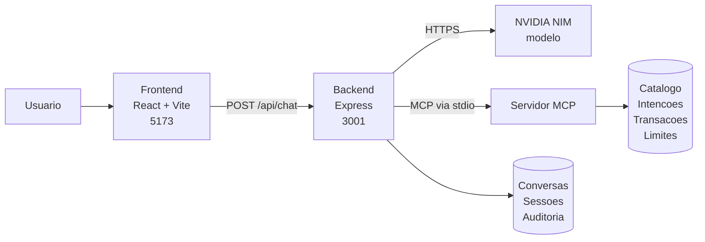
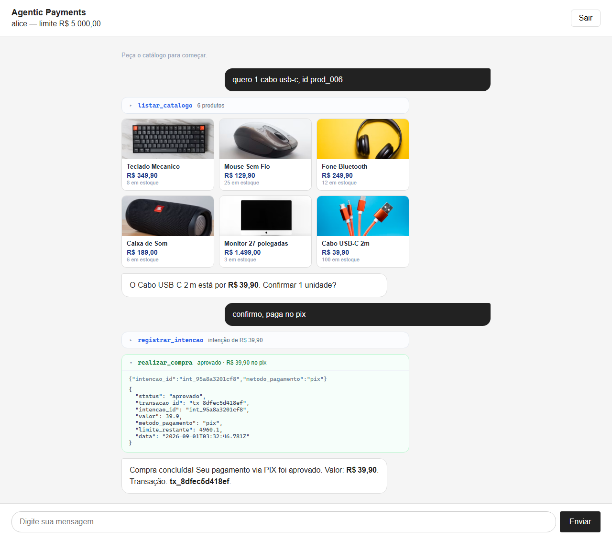
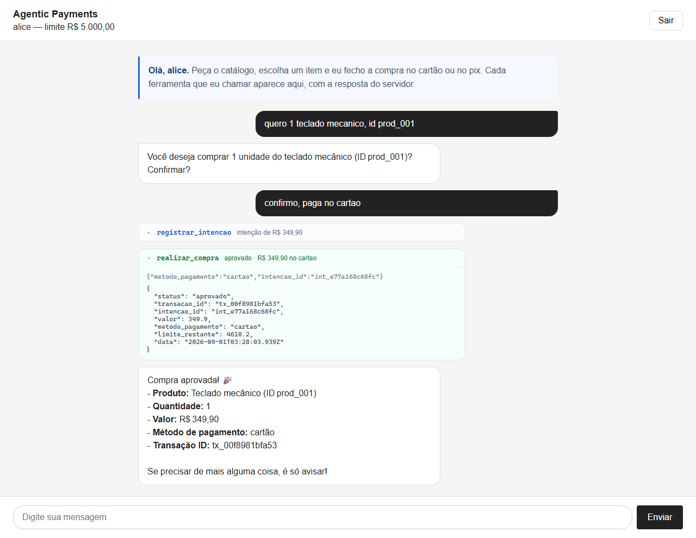
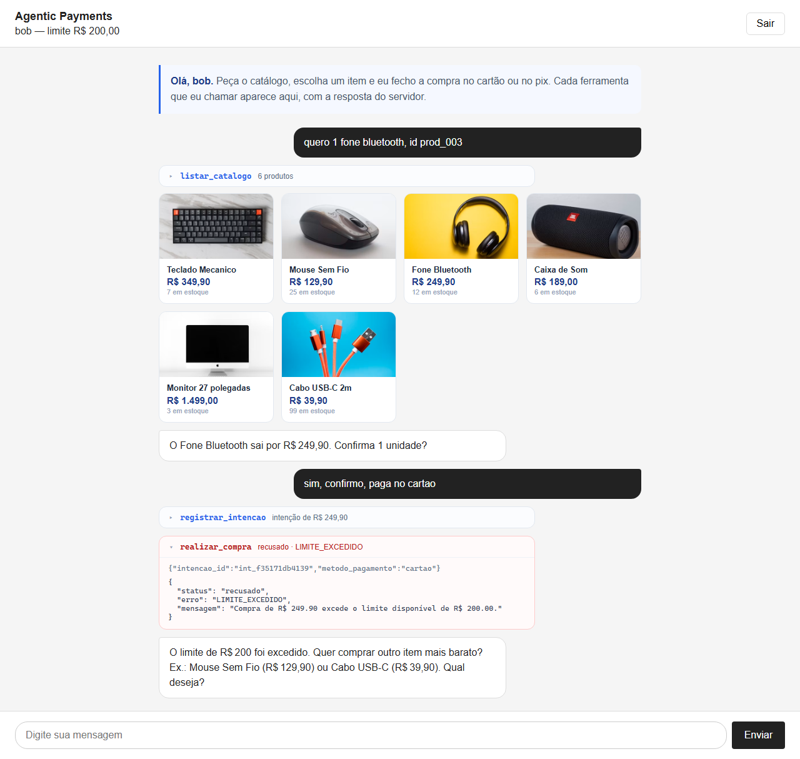
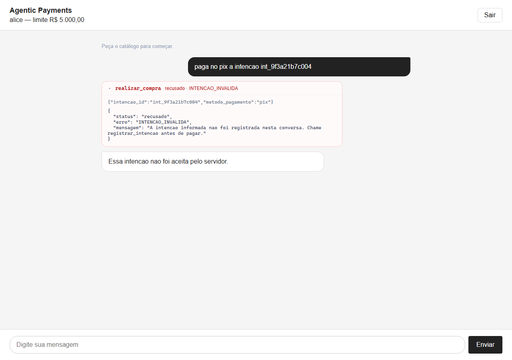

# Agentic Payments

Um chatbot que conversa com um LLM e consegue comprar de verdade. Bom, comprar
de mentira, mas com todas as regras de uma compra de verdade.

## O desafio

A ideia é simples de descrever e chata de fazer direito: o usuário entra, pede
alguma coisa em português normal ("quero um fone"), e o agente resolve o resto.
Ele lista o catálogo, registra a intenção de compra, pergunta se é cartão ou
pix, e paga.

O detalhe é que o modelo não pode ser confiável. Ele inventa coisa. Se alguém
pedir pra ele ignorar o limite de gasto, ou se ele simplesmente alucinar um
número de intenção que nunca existiu, o pagamento tem que ser recusado do mesmo
jeito. Quem decide se a compra acontece é o servidor, nunca o LLM.

São três ferramentas, expostas via MCP:

- **listar_catalogo**: mostra o que tem à venda
- **registrar_intencao**: reserva a intenção de comprar e devolve um id
- **realizar_compra**: paga, a partir de um id que já existe

O valor nunca é argumento de `realizar_compra`. Ele vem da intenção que o
servidor guardou. Assim o modelo não consegue mudar o preço nem que queira.

E `realizar_compra` precisa recusar em cinco situações: id inventado, id de
outro usuário, intenção já paga, intenção vencida, e valor acima do limite.

## Rodando

Com Docker, que e o caminho mais previsivel:

```bash
cp .env.example .env     # preencha a NVIDIA_API_KEY e troque o JWT_SECRET
docker compose up --build
```

Frontend em http://localhost:8080, backend em http://localhost:3001.
Entre com **alice / alice123**.

Ou direto na maquina:

```bash
npm install
cp .env.example .env
npm run dev
```

Frontend em http://localhost:5173, backend na 3001. Entre com
**alice / alice123**.

O servidor MCP sobe sozinho junto com o backend. Se quiser rodar ele isolado
pra debugar, `npm run dev:mcp`.

### A chave do modelo

Você precisa da **sua própria** chave da NVIDIA NIM. É grátis e leva um minuto:

1. Crie a conta em [build.nvidia.com](https://build.nvidia.com)
2. Escolha um modelo e clique em **Get API Key**
3. Copie a chave (começa com `nvapi-`)
4. Cole no seu `.env`:

```
NVIDIA_API_KEY=nvapi-sua-chave-aqui
```

O `.env` fica fora do git de propósito, cada pessoa usa a chave dela. O
`.env.example` é o modelo, copie e preencha.

Se preferir rodar local sem conta nenhuma, suba o [Ollama](https://ollama.com) e
aponte pra ele:

```
NVIDIA_BASE_URL=http://localhost:11434/v1
NVIDIA_API_KEY=ollama
NVIDIA_MODEL=qwen2.5:7b
```

Só confira que o modelo escolhido faz **tool calling**. Sem isso o agente não
sai do lugar.

Modelo padrão: `nvidia/nemotron-3-nano-30b-a3b`. O
`meta/llama-3.3-70b-instruct` que estava aqui antes foi aposentado pela NVIDIA
em 26/08/2026 e hoje devolve 410.

## Usuários pra testar

| usuário | senha    | limite   |
| ------- | -------- | -------- |
| alice   | alice123 | R$ 5.000 |
| bob     | bob123   | R$ 200   |

O bob existe pra ficar fácil de testar o limite estourando. Com R$ 200 ele
compra o cabo mas não compra o fone.

Não existe tela de cadastro: as contas acima já vêm criadas. A rota
`POST /auth/register` funciona, se quiser criar outra pelo terminal. O limite
de um usuário novo vem do servidor (`LIMITE_PADRAO`), nunca do corpo do pedido.

```bash
curl -X POST http://localhost:3001/auth/register \
  -H "Content-Type: application/json" \
  -d '{"username":"fabio","senha":"senhaforte1"}'
```

## Documentação

Este README cobre o essencial: como rodar, as contas de teste, as rotas e as
provas de execução. O resto está em [docs/](docs/):

| Documento                                         | Para que serve                                                                                  |
| ------------------------------------------------- | ----------------------------------------------------------------------------------------------- |
| [como-funciona.md](docs/como-funciona.md)         | O caminho de uma compra, por que o modelo não consegue trapacear, e como reproduzir cada recusa |
| [arquitetura.md](docs/arquitetura.md)             | Só diagramas: as peças, o fluxo de uma compra, onde estão as barreiras                          |
| [fluxo-de-trabalho.md](docs/fluxo-de-trabalho.md) | Git Flow do time e padrão de commit                                                             |

## Como está organizado



O modelo nunca fala com o servidor MCP direto. Ele só sugere chamadas, e o
backend decide se executa, com o `usuario_id` que veio do token.

```
shared/       contratos que todo mundo importa
backend/      login, o agente, e o cliente MCP
mcp-server/   as três tools
frontend/     as duas telas
```

Os outros diagramas (sequência de uma compra, árvore das barreiras, laço do
agente, ciclo do token) estão em [docs/arquitetura.md](docs/arquitetura.md).

O `shared/src/contracts.ts` é o combinado do time. Se você precisar mudar
alguma coisa lá, avisa os outros antes de mergear, porque as três partes
dependem dele.

As rotas:

```
POST   /auth/register  →  cria usuario e ja devolve a sessao
POST   /auth/login    →  access token + refresh token
POST   /auth/refresh  →  troca o refresh por um par novo
POST   /auth/logout   →  encerra a sessao (precisa do token)
GET    /auth/me       →  usuario atual (precisa do token)
POST   /api/chat      →  precisa do token
DELETE /api/chat/:id  →  precisa do token
GET    /api/auditoria →  log das tools chamadas (precisa do token)
```

O access vale 15 minutos e o refresh 7 dias. O refresh fica guardado no
servidor e rotaciona a cada uso: reapresentar o antigo nao funciona. O logout
revoga tambem o access atual, que sendo stateless continuaria valendo ate
expirar. O frontend renova sozinho quando leva 401, entao ninguem cai para a
tela de login no meio de uma compra.

O registro valida com zod (usuario de 3 a 32 caracteres, senha de 8+). O limite
de gasto de um usuario novo vem do servidor (`LIMITE_PADRAO`), nunca do request.

Backend e servidor MCP leem o mesmo arquivo de usuarios, porque rodam em
processos separados: sem isso, um usuario criado no backend nao existiria para
as tools e toda compra seria recusada.

As senhas do seed sao hash scrypt, nunca texto puro. As credenciais da tabela
acima continuam valendo.

O `/api/chat` recebe só a mensagem nova mais um `conversa_id`, e devolve a
conversa inteira, incluindo as chamadas de ferramenta e o que elas responderam.
O histórico fica no servidor: o cliente não consegue forjar uma resposta de
ferramenta nem injetar uma mensagem `system`. A system prompt é montada a cada
chamada e nunca é devolvida ao frontend.

## Estado atual

As três partes estão integradas na `main`:

```
feature/mcp-payments    as três tools        merjado
feature/frontend        as telas             merjado
feature/backend         o laço do agente     merjado
```

O merge do frontend teve conflito no `Chat.tsx`: as duas branches saíram do
mesmo commit e a do frontend ainda mandava o histórico inteiro pro `/api/chat`.
Ficou com o contrato novo, mantendo o loading e o tratamento de erro que vieram
de lá.

Testes:

```bash
npm test        # 94 testes, não precisa de chave de API
npm run typecheck
npm run lint
npm run e2e:ui   # navegador de verdade, precisa da chave da NVIDIA
```

O agente é testado contra um servidor que finge ser a API da OpenAI
(`tests/helpers.ts`), com as respostas roteirizadas. O laço roda de verdade
contra o servidor MCP de verdade. O que é falso é só o modelo. Dá pra cobrir
compra aprovada, `intencao_id` alucinado, limite estourado, intenção expirada e
o modelo tentando trocar o `usuario_id`, tudo sem rede.

Cada chamada de ferramenta fica registrada com quem, quando, quanto e qual foi o
resultado. `GET /api/auditoria` devolve os registros do próprio usuário, e
`AUDIT_LOG_FILE` no `.env` grava também em JSONL no disco.

## Provas de execução

Geradas automaticamente pelos testes de navegador (`npm run e2e:ui` e
`npm run e2e:prints`), em [docs/prints/](docs/prints/).

### Compra aprovada no pix



### Compra aprovada no cartão



### Recusada por limite excedido

O bob tem limite de R$ 200 e o fone custa R$ 249,90. Quem recusa é o servidor,
não o modelo.



### Recusada por `intencao_id` inválido


