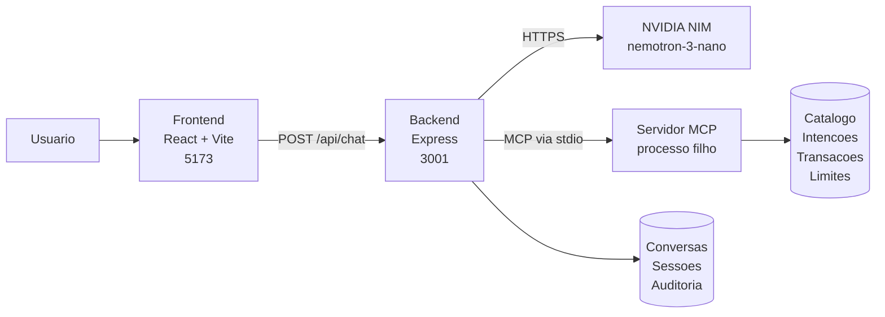
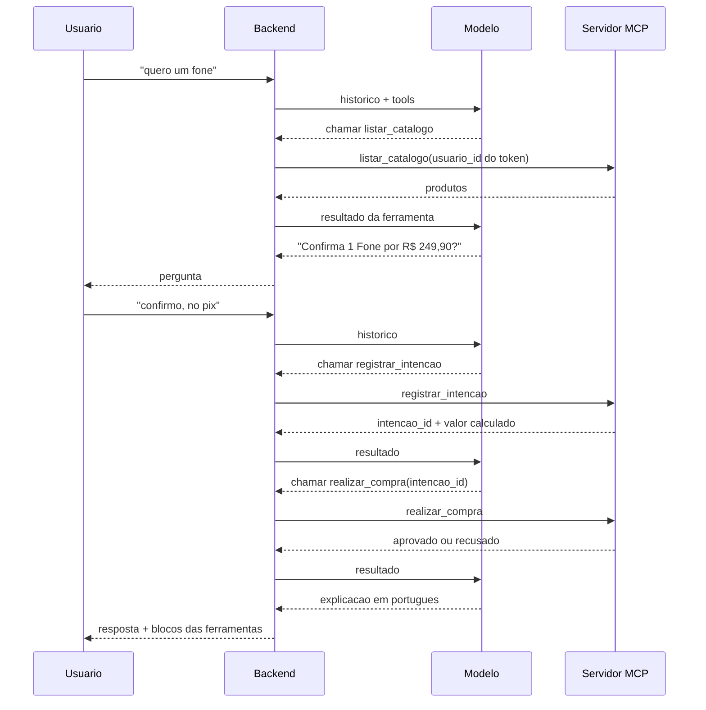
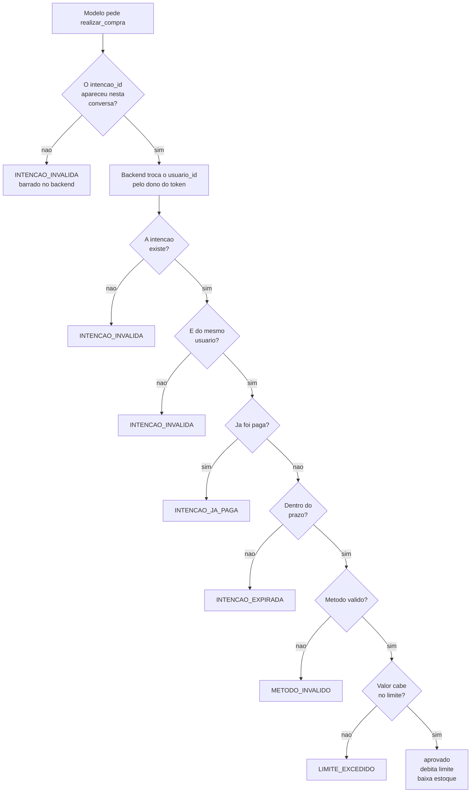
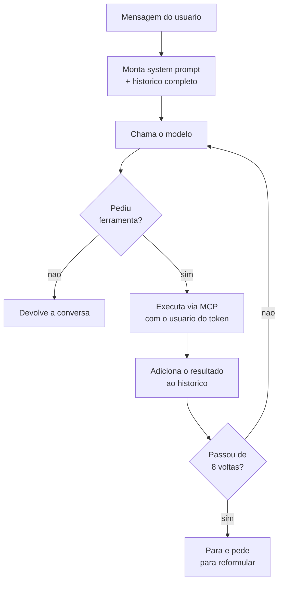
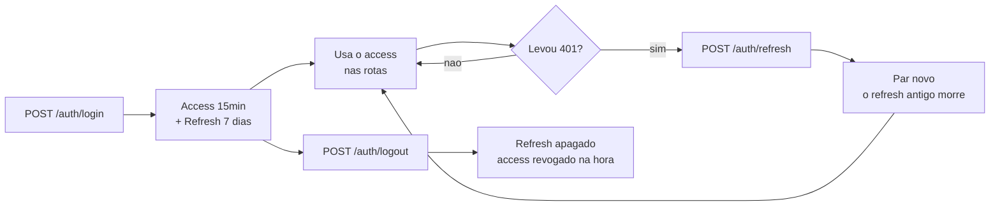

# Arquitetura

Diagramas do projeto. Para a explicação em texto, veja
[como-funciona.md](como-funciona.md).

## As peças

O modelo nunca fala com o servidor MCP direto. Ele só sugere chamadas, e o
backend decide se executa.

## Uma compra, do pedido ao pagamento

## Onde estão as barreiras

O valor comparado com o limite vem da intenção guardada pelo servidor, nunca do
que o modelo escreveu. `realizar_compra` não tem campo de valor.

## O laço do agente

## Autenticação

